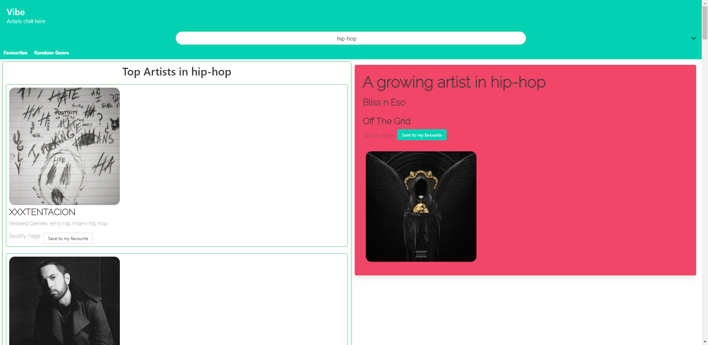

# Vibe

## Description

This app helps you search for artists by genres. 
It will show you the most popular artists and will also offer you one artist that yet to be famous so you can discover new stars before anyone.

## Table of Contents (Optional)

If your README is long, add a table of contents to make it easy for users to find what they need.

- [Installation](#installation)
- [Usage](#usage)
- [Credits](#credits)
- [Features](#features)

## Installation
In order to use this app you will need a spotify account.
If you don't have one simply create one from the spotify
[website](https://www.spotify.com/au/signup?forward_url=https%3A%2F%2Fopen.spotify.com%2F).

Once you have an account you can start using this app.

## Usage
[**Deployed application**](https://gator2-0.github.io/Vibe/)

To get started, simply select a genre from the dropdown box.
you can then scroll the top artist and have a look at the rising star.
There is alink to each artist sotify page and you can also save your favourites artists.

## Credits

The 3 people that have work on this project are:
- [Salah Dannaoui](https://github.com/SalahDannaoui)
- [Adam Day](https://github.com/Sype7973)
- [Jeremy Decherat](https://github.com/Gator2-0)

## Features

There are 3 main features:
- **dopdown list of genres** - select your prefered genre and scroll though the artists
- **random genres** - If you dont know what to look for, give this a try and get ready to find a new favourite genre.
- **favourites** - list of all you favourites artists

